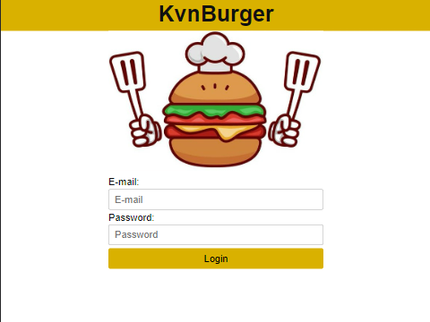

#  Burger Queen (API Client) with TypeScript proposal

## Stack tecnológico

- `ViteJs` para construir el proyecto.
- `React Testing Library` para las pruebas de componentes.
- `React Router DOM` para las rutas de la SPA.
- `react-router-dom` para la dirección de rutas
- `ESLint` y `Prettier` para el formato de archivos

### Peticiones al API

El Common.service.ts se encarga de realizar la petición, controlar el token y agregar los encabezados correctos, así como también leer el mensaje de error e interceptarlo.

### Token Repository

En este archivo se controla el token y su almacenamiento y lectura del localStorage, siendo el encargado de guardar la sesión y cerrarla.

Así como también realiza la petición de inicio de sesión.

### Jerarquía de componentes vista /orders/create

Una imagen 

https://es.react.dev/images/docs/s_thinking-in-react_ui_outline.png

Describir la responsabilidad de cada componente y props de cada uno

Describir como manejas el estado

Describir efectos de cada componente

### Modelos

- Order: Contiene el type de la orden, del producto de la orden y el type de estado de la orden.
- Product: Contiene el type del producto y el type de tipo de producto
- Response: Contiene el type del response del login y parámetros del request
- Role: Contiene el type del tipo de usuario
- User: Contiene el type del usuario y usuario actual

### Configuraciones del proyecto

Hablar de configuraciones package.json, vite y ts

### Pruebas

Para la configuración del entorno de pruebas se está usando:

- Jest
- Babel
- TSJest

Actualmente se tienen los test:

- Waiter

	- Should make request with correct params on submit the order

- CreateOrder

	- Should show total prices as expected when have selected products
	- Should show as disable submit button when client name is not set
	- Should show as disable submit button when has not products
	- Should show as NOT disable submit button when order is ready to be submit

## Estructura de archivos

- `src/assets`: directorio para imágenes.
- `src/components`: directorio para componentes React.
- `src/models`: directorio para interfaces TypeScript.
- `src/routes`: directorio para componentes relacionados con rutas.
- `src/services`: directorio para las funciones que interactúan con la API Rest y `localstorage`.

## Rutas

- Usar `react-router-dom` versión *6.x* como librería de rutas.
- Se definirán las siguientes rutas:

    
	- /login: formulario de login (historia de usuaria 1)
	
		
    
	- /orders/create: creación de pedidos (historia de usuaria 2)

		

	- /home: menú de módulos
	- /orders/pending: listado de pedidos para preparar para jefa de cocina (historia de usuaria 3)
	- /orders/delivering: listado de pedidos listos para servir para mesero (historia de usuario 4)
	- /orders/delivered: listado de pedidos para entregados
	- /admin/products: CRUD de productos (historia de usuario 5)
	- /admin/users: CRUD de usuarias (historia de usuario 6)

### Protección de rutas

Para proteger las rutas creamos un componente [ProtectedRoute](src\routes\protected-route.tsx)
