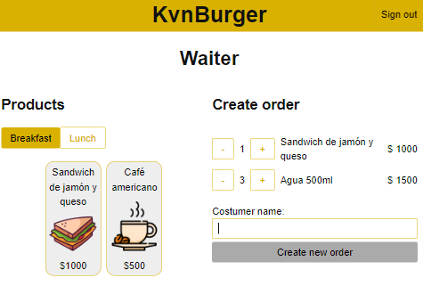
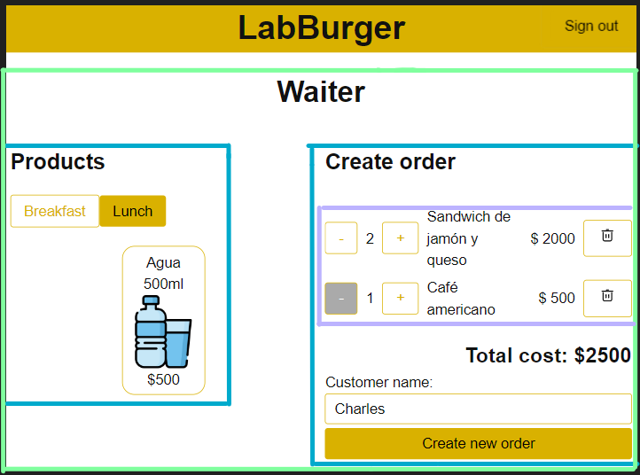

# Burger Queen API Client with React y TypeScript

## Introducción

Este repositorio pretender ser un modelo de implementación para
el proyecto Burger Queen API Client con React y TypeScript con
el objetivo de alinear a todas las coaches de Laboratoria sobre
las **buenas prácticas y recomendaciones** que debemos dar a las
estudiantes en OH, PF, Q&A y demás espacios en que interactuemos
con ellas.

No se pretende que las estudiantes tengan una implementación
exacta a la de este repositorio. De este repositorio se pueden
extraer buenas prácticas para ser implementadas por las
estudiantes pero adaptándolas a su _codebase_.

Por ahora, se ha implementado las Historias de Usuaria 1 y 2.
A mediano plazo se espera completar las 3 y 4.

Si quieres proponer una mejora puedes crear un issue o PR. Quienes
mantienen este repositorio son [Kevin Alvarado](kevin.alvarado@laboratoria.la)
y [Sergio Sinuco](sergio.sinuco@laboratoria.la).

## Stack tecnológico

Se debe recomendar a las estudiantes implementar el proyecto con el siguiente stack
tecnológico:

- `ViteJs` para construir el proyecto.
- `React Testing Library` para las pruebas de componentes.
- `React Router DOM` para las rutas de la SPA.
- `ESLint` y `Prettier` para el formato de archivos

## Scripts del proyecto

Suponiendo que se ha usado ViteJs para construir el proyecto,
se debe recomendar a las estudiantes definir el 
siguiente script `tsc` en el package.json 
que inicia la compilación y validación de TypeScript en Watch.

```json
	"ts": "tsc --watch"
```

Y luego modificar los `dev` y `build` para que ejecuten este script:

```json
	"dev": "tsc && vite",
	"build": "tsc && vite build",
```

## Estructura de directorios

Se debe recomendar a las estudiantes estructurar el proyecto con la siguiente jerarquía
de directorios:

- `src/assets`: directorio para imágenes.
- `src/components`: directorio para componentes React. Aqui hay un subdirectorio para
los archivos .tsx, .spec.tsx y module.css de cada componente.
- `src/hooks`: directorio para custom hooks.
- `src/models`: directorio para types de TypeScript.
- `src/pages`: directorio para componentes React desplegados directamente por las rutas.
- `src/routes`: directorio para componentes relacionados con rutas.
- `src/services`: directorio para las funciones que interactúan con la API Rest y `localStorage`.

## Rutas

Se debe recomendar a las estudiantes definir las siguientes rutas:
   
	- /login: formulario de login (historia de usuaria 1)
	
		
    
	- /orders/create: creación de pedidos (historia de usuaria 2)

		

	- /home: menú principal
	- /orders/pending: listado de pedidos para preparar para la jefa de cocina (historia de usuaria 3)
	- /orders/delivering: listado de pedidos listos para servir para la mesera (historia de usuario 4)
	- /orders/delivered: listado de pedidos entregados para la mesera
	- /admin/products: CRUD de productos (historia de usuario 5)
	- /admin/users: CRUD de usuarias (historia de usuario 6)

### Protección de rutas

Las rutas deben protegerse teniendo en cuenta que se haya iniciado sesíón
en la aplicación y el rol de la usuaria. Por ejemplo, una usuaria mesera
no podría ingresar a la ruta /admin/products.

Se debe recomendar a las estudiantes crear un componente
que haga uso de `<Outlet/>` y `<Navigate/>` para proteger la ruta.
El componente [ProtectedRoute](src\routes\protected-route.tsx) es 
ejemplo de lo que se puede crear.

### Definición de rutas

Se debe recomendar a las estudiantes usar un `<RouterProvider>` para
definir las rutas de la aplicación. Este componente recibe un
arreglo de rutas que puede ser usado tanto en el componente `<App>`
de aplicación, como en el componente `<MemoryRouter>` de las pruebas.

## Componentes

Se debe recomendar a las estudiantes:

- crear un directorio `src/components` para los componentes y allí
un subdirectorio para los archivos .tsx, .spec.tsx y module.css de cada componente.
- _tipar_ cada componente con React.FC
- crear un _type_ para los props de cada componente y usarlo
en tipo genérico de React.FC
- definir componentes en archivos .tsx
- definir un solo componente por archivo
- usar como nombre del archivo .tsx el nombre del componente

## Jerarquía de componentes vista /orders/create

Para la vista de la _Historia de Usuaria 2 Mesero/a debe poder tomar pedido de cliente/a_
usualmente las estudiantes diseñan una vista como la siguiente:



Para implementar esta vista se debe recomendar a las estudiantes
seguir el paso a paso de la sección
[Pensar en React](https://es.react.dev/learn/thinking-in-react)
de la documentación oficial.

Como primer paso de esta guía, se debe separar la UI
en una jerarquía de componentes. Se recomienda dividirla en 4 componentes:

#### `<Waiter>`

Controla el estado de la orden y productos, conteniendo 2 componentes `<CreateOrder>` y `<ProductList>`.

* Props: no tiene.

* Hooks:

	* useReducer:
		* Orden: permite controlar la orden, agregar productos, el nombre del cliente y modificarlos.
	* useState:
		* products: Permite tener en memoria el listado de productos que puede ofrecer el restaurante.
		* message: Permite tener en memoria el mensaje a mostrar al usuario cuando crea la orden.
		* selectedCategory: Permite tener en memoria qué listado mostrar al usuario según el tipo de producto que se haya seleccionado.
	* useRequestHook:
		* crear orden: Permite controlar el estado de carga, petición y su resultado al momento de crear la orden.

* Componentes que contiene:

	* `<ProductList>`
	* `<CreateOrder>`

#### `<ProductList>`

Permite visualizar el lista de productos con sus precios para ser seleccionados y agregados a la comanda.

* Props: 
	* onModifyProductQty: callback que se llama al hacer clic en un producto de la lista.
	* products: arreglo de productos a mostrar.

* Hooks: no tiene.
* Componentes que contiene: no tiene.

#### `<CreateOrder>`

Permite visualizar el pedido, costo total y formulario de envío de la orden.
También permite modificar de cantidad de cada producto.
Contiene un componente OrderProductList.

* Props:

	* order: objeto con los datos de la orden que se está creando.
	* disableForm: boolean para habilitar o deshabilitar el envio del formulario.
	* onRemoveProductFromList: callback que se llama al hacer clic en el botón para eliminar un producto la orden.
	* onModifyProductQty: callback que se llama al hacer clic en los botones para agregar o quitar una cantidad de un producto a la orden.
	* onChangeCustomer: callback que se llama al modificar el valor del campo de texto del nombre del cliente.
	* onSubmit: callback que se llama al hacer clic en el botón de creación de orden.

* Hooks: no tiene.
* Componentes que contiene:
	* `<OrderProductList>`

#### `<OrderProductList>`

Permite visualizar el listado de productos agregados a la orden,
con su subtotal y con la posibilidad de agregar o quitar uno, o quitar
el producto completo.

* Props:

	* order: objeto con los datos de la orden que se está creando.
	* disableForm: boolean para habilitar o deshabilitar el envio del formulario.
	* onModifyProductQty: callback que se llama al agregar o quitar una cantidad de un producto a la orden.
	* onRemoveProductFromList: callback que se llama al eliminar un elemento de la lista de productos de la orden.

* Hooks: no tiene.
* Componentes que contiene: no tiene.

## Modelos

Se debe recomendar a las estudiantes definir tipos
para los principales modelos de la aplicación:

- Order: Contiene el type de la orden, del item de la orden y el type de estado de la orden.
- Product: Contiene el type del producto y el type de tipo de producto
- Response: Contiene el type del response del login y parámetros del request
- Role: Contiene el type del tipo de usuario
- User: Contiene el type del usuario y usuario actual

Se recomienda el uso de `type` sobre `interface` porque
esta implementación no es OOP.

## Servicios

### Peticiones al API

El Common.service.ts se encarga de realizar la petición y agregar el encabezado `"Content-Type": "application/json"`, así como también leer el mensaje de error e interceptarlo.

### Token Repository

En este archivo se controla el token y su almacenamiento y lectura del localStorage, siendo el encargado de guardar la sesión y cerrarla.

Así como también realiza la petición de inicio de sesión.

## Pruebas

Para la configuración del entorno de pruebas se está usando:

- Jest
- Babel
* Testing library
* Jest environment jsdom

Actualmente se tienen los test:

- Waiter

	- Debería lanzar la petición con los parámetros correctos

- CreateOrder

	- Debería de mostrar el precio cuando se seleccionen productos
	- Debería de mostrar deshabilitado el botón cuando no se haya ingresado nombre de cliente
	- Debería de mostrar deshabilitado el botón cuando no se hayan seleccionado productos
	- Debería de mostrar habilitado el botón cuando la orden esté lista para ser enviada

* OrderRepository

	* Debería de realizar la petición con los parámetros correctos.


